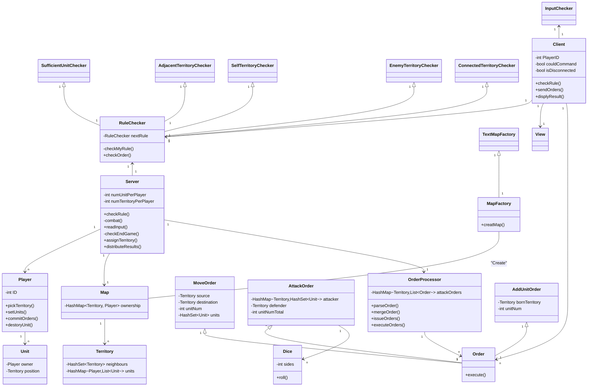

# ECE651_G10_RISK

```mermaid
classDiagram
 
RuleChecker "1" <-- "1" Server
    SufficientUnitChecker "1" <|-- "1" RuleChecker
    AdjacentTerritoryChecker "1" <|-- "1" RuleChecker
    SelfTerritoryChecker "1" <|-- "1" RuleChecker
    EnemyTerritoryChecker "1" <|-- "1" RuleChecker
    ConnectedTerritoryChecker "1" <|-- "1" RuleChecker
    InputChecker "1" <-- "1" Client
    Server "1" --> "n" Player
    Client "1" --> "1" RuleChecker
    Server "1" --> "1" Map
    Map "1" --> "n" Territory
    Player "1" --> "n" Unit
    TextMapFactory "1" <|-- "1" MapFactory
    MapFactory -- Map: "Create"
    Client "1" --> "1" View
    MoveOrder "1" <|-- "1" Order
    AttackOrder "1" <|-- "1" Order
    OrderProcessor "1" --> "n" Order
    Client "1" --> "n" Order
    AddUnitOrder "1" <|-- "1" Order
    Server "1" --> "1" OrderProcessor
    AttackOrder "1" --> "n" Dice


    class Server{
        -int numUnitPerPlayer
        -int numTerritoryPerPlayer
        +checkRule()
        -combat()
        +readInput()
        -checkEndGame()
        +assignTerritory()
        +distributeResults()
    }

    class OrderProcessor {
        -HashMap~Territory,List~Order~~ attackOrders
        +parseOrder()
        +mergeOrder()
        +issueOrders()
        +executeOrders()
    }

    class Order {
        +execute()
    }

    class MoveOrder {
        -Territory source
        -Territory destination
        -int unitNum
        -HashSet~Unit~ units
    }

    class AttackOrder {
        -HashMap~Territory,HashSet~Unit~~ attacker
        -Territory defender
        -int unitNumTotal
    }

    class AddUnitOrder{
        -Territory bornTerritory
        -int unitNum
    }

    class Dice{
        -int sides
        +roll()
    }

    class Client {
        -int PlayerID
        -bool couldCommand
        -bool isDisconnected
        +checkRule()
        +sendOrders()
        +displyResult()
    }

    class RuleChecker {
        -RuleChecker nextRule
        -checkMyRule()
        +checkOrder()
    }

    class ConnectedTerritoryChecker {

    }

    class AdjacentTerritoryChecker {

    }

    class SufficientUnitChecker {

    }

    class SelfTerritoryChecker {

    }

    class EnemyTerritoryChecker {

    }

    class InputChecker {

    }

    class Player {
        -int ID
        +pickTerritory()
        +setUnits()
        +commitOrders()
        +destoryUnit()
    }

    class Map {
        -HashMap~Territory, Player~ ownership
    }

    class View {

    }

    class MapFactory {
        +creatMap()
    }

    class TextMapFactory {

    }

    class Territory {
        -HashSet~Territory~ neighbours
        -HashMap~Player,List~Unit~~ units 
    }

    class Unit {
        -Player owner
        -Territory position 
    }       
```