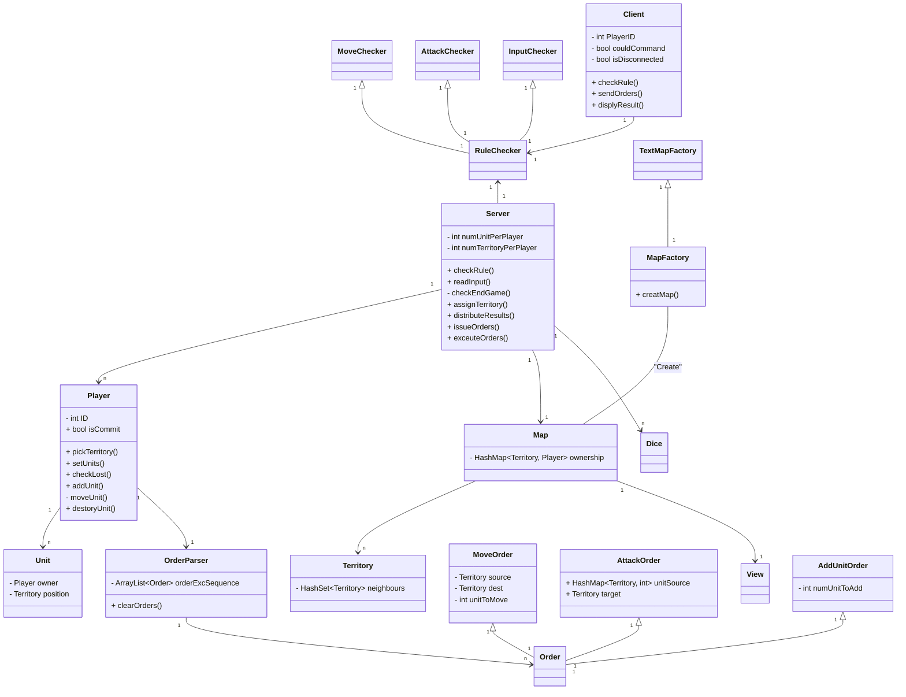

# ECE651_G10_RISK

```mermaid
classDiagram
 
    RuleChecker "1" <-- "1" Server
    MoveChecker "1" <|-- "1" RuleChecker
    AttackChecker "1" <|-- "1" RuleChecker
    InputChecker "1" <|-- "1" RuleChecker
    Server "1" --> "n" Player
    Client "1" --> "1" RuleChecker
    Server "1" --> "1" Map
    Map "1" --> "n" Territory
    Player "1" --> "n" Unit
    TextMapFactory "1" <|-- "1" MapFactory
    MapFactory -- Map: "Create"
    Map "1" --> "1" View
    MoveOrder "1" <|-- "1" Order
    AttackOrder "1" <|-- "1" Order
    OrderParser "1" --> "n" Order
    AddUnitOrder "1" <|-- "1" Order
    Player "1" --> "1" OrderParser
    Server "1" --> "n" Dice


    class Server{
        - int numUnitPerPlayer
        - int numTerritoryPerPlayer
        + checkRule()
        + readInput()
        - checkEndGame()
        + assignTerritory()
        + distributeResults()
        + issueOrders()
        + exceuteOrders()
    }

    class OrderParser {
        - ArrayList~Order~ orderExcSequence
        + clearOrders()
    }

    class Order {

    }

    class MoveOrder {
        - Territory source
        - Territory dest
        - int unitToMove 

    }

    class AttackOrder {
        + HashMap~Territory, int~ unitSource
        + Territory target
    }

    class AddUnitOrder{
        - int numUnitToAdd
    }

    class Dice{

    }

    class Client {
        - int PlayerID
        - bool couldCommand
        - bool isDisconnected
        + checkRule()
        + sendOrders()
        + displyResult()
    }

    class RuleChecker {
    
    }

    class MoveChecker {

    }

    class AttackChecker {

    }

    class InputChecker {

    }

    class Player {
        - int ID
        + bool isCommit
        + pickTerritory()
        + setUnits()
        + checkLost()
        + addUnit()
        - moveUnit()
        + destoryUnit()
    }

    class Map {
        - HashMap~Territory, Player~ ownership
    }

    class View {

    }

    class MapFactory {
        + creatMap()
    }

    class TextMapFactory {

    }

    class Territory {
        - HashSet~Territory~ neighbours
    }

    class Unit {
        - Player owner
        - Territory position 
    }       
```