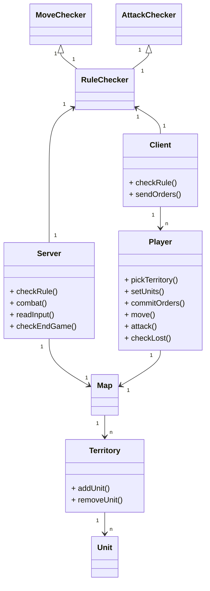

# ECE651_G10_RISK

```mermaid
classDiagram
 
    RuleChecker "1" <-- "1" Server
    RuleChecker "1" <-- "1" Client
    MoveChecker "1" <|-- "1" RuleChecker
    AttackChecker "1" <|-- "1" RuleChecker
    Client "1" --> "n" Player
    Server "1" --> "1" Map
    Player "1" --> "1" Map
    Map "1" --> "n" Territory
    Territory "1" --> "n" Unit


    class Server{
        + checkRule()
        + combat()
        + readInput()
        + checkEndGame()
    }

    class Client {
        + checkRule()
        + sendOrders()
    }

    class RuleChecker {
    
    }

    class MoveChecker {

    }

    class AttackChecker {

    }

    class Player {
        + pickTerritory()
        + setUnits()
        + commitOrders()
        + move()
        + attack()
        + checkLost()
    }

    class Map {

    }

    class Territory {
        + addUnit()
        + removeUnit()
    }

    class Unit {

    }       
```