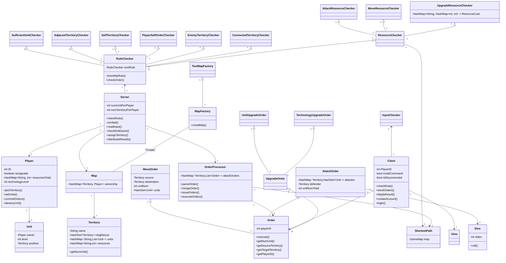

# ECE651_G10_RISK

## Running Instruction
 1. Go to root directory in the project.
 2. Run './gradlew installDist'
 3. Run server first through './server/build/install/server/bin/server'.
 4. Run several clients through './client/build/install/client/bin/client'
 5. Enjoy the game!

